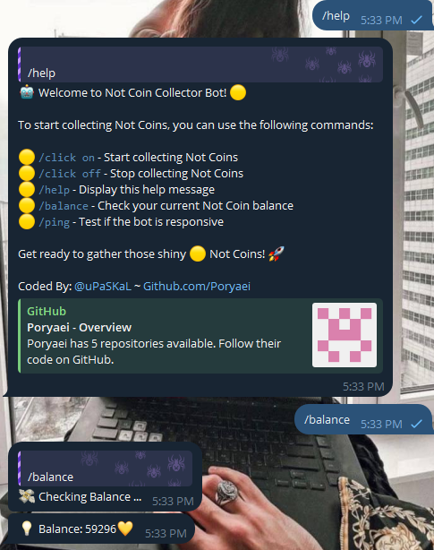

# NotCoin Clicker Bot

A Python bot and automated clicker for accumulating NotCoins on Telegram.

## About

This project contains code for a Telegram bot and background clicker that interacts with the NotCoin Bot to automatically collect NotCoins on your behalf. It runs continuously in the background while your collection is enabled.

## Prerequisites
- Node.js 16 or higher
- A Telegram API ID and hash

## Getting Started

1. Clone the repository
   ```
   git clone https://github.com/Poryaei/NotCoin-Clicker.git
   ```
   
2. Install dependencies
   ```
   pip install -r requirements.txt
   ```
   
3. Set up your Telegram API credentials And ADMIN Telegram chat id 
   - Create a new bot and get the API key and hash
   - Change lines (15 and 16)
   - Get admin chat id from (https://t.me/chatIDrobot)
   - Change line (24)
   
4. Run the clicker bot
   ```
   python clicker.py
   ```
   
5. Control with bot commands:
   - `/help` to view help
   - `/click` to enable/disable collection 
   - `/balance` to check NotCoin balance

## Screenshots



   
## Usage

Keep your Telegram account signed in and ensure an active internet connection for automated coin collection.

## Disclaimer

This project is intended for educational purposes only. Use at your own risk.

## Contributing

Contributions are welcome! If you have any suggestions or improvements, please feel free to open an issue or submit a pull request.

